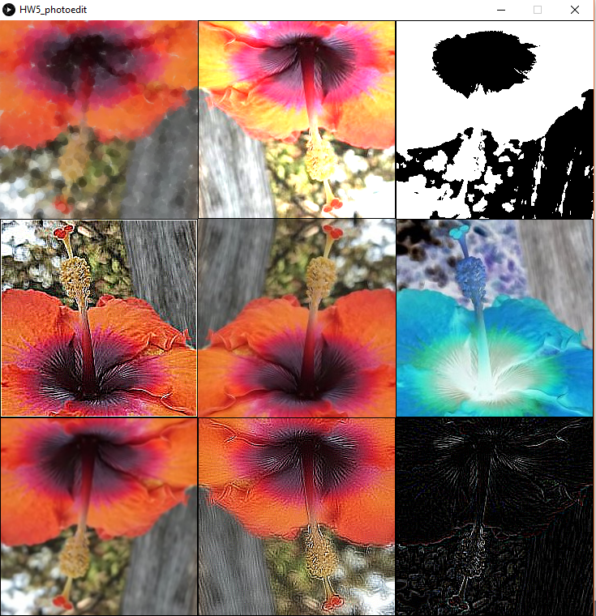

# viz_processing
visualizations using processing

1) Geometrical painting :  piet mondrian recreation

2) Use of arrays to create a lightningfight ( moving image )

3) Image processing - different styles of phot editing

4) Internet vizualization of real-time or near real-time data

![weather forecast](
